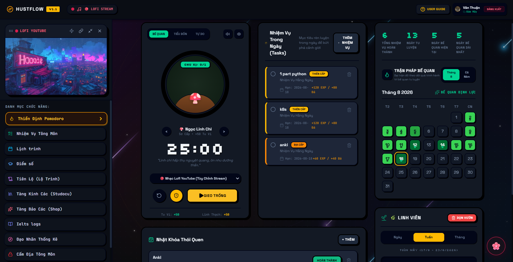

# 🌌 HUSTFlow - Nền Tảng Bế Quan Tu Luyện & Trợ Thủ Tập Trung Toàn Diện

**Tech Stack**: React 18 • TypeScript • Vite • Tailwind CSS • Chrome Extension MV3 • Google Cloud APIs

> **HUSTFlow** là ứng dụng hỗ trợ quản lý thời gian, tăng cường tập trung và tối ưu hóa hiệu suất học tập dành cho sinh viên theo phong cách **Cyber-Cultivation (Tu Tiên Kỹ Thuật Số)**.

---

## 📖 1. Tổng Quan Dự Án (Project Overview)

**HUSTFlow** kết hợp giữa phương pháp quản lý thời gian khoa học (Pomodoro Timer), cơ chế Gamification tu luyện (Tu vi, Linh thạch, Cột mốc thành tựu), Trợ lý AI đa nhân vật thông minh và hệ sinh thái đồng bộ đám mây toàn diện từ **Google Cloud (Google Tasks, Google Calendar, Google Sheets & Firebase Auth)**.

Ứng dụng giúp sinh viên vượt qua sự xao nhãng của mạng xã hội, quản lý danh sách công việc & thời khóa biểu tập trung, theo dõi điểm số GPA/CPA và tải tài liệu học tập một cách dễ dàng, nhanh chóng.

---

## ⚡ 2. Danh Sách Tính Năng Chi Tiết (Key Features)

### 🔥 Thiền Định Pomodoro & Trận Pháp Chặn Tâm Ma
* **Đồng Hồ Tập Trung Pomodoro**: Thiết lập thời gian bế quan tu luyện linh hoạt, phát nhạc nền Lofi thư giãn.
* **Trận Pháp Chặn Tâm Ma (Chrome Extension Blocker)**: Tiện ích mở rộng chặn truy cập các trang web xao nhãng (Facebook, YouTube, TikTok...) trong suốt thời gian tập trung.

### 📚 Tàng Kinh Các (Studocu HD Downloader)
* **Giải Mã & Tải PDF 1-Click**: Tự động gỡ mờ, giải mã và trích xuất tài liệu Studocu chất lượng cao.
* **Trình Đọc HD & Xuất In Native**: Đọc trực tiếp trên web với công cụ phóng to/thu nhỏ, chọn khoảng trang cần in và tải về file PDF nét căng.

### 🤖 Trợ Lý AI Đa Nhân Vật (Groq Cloud API)
* **3 Nhân Vật Tính Cách (Persona)**:
  * 🌸 **Lý Mộ Uyển**: Dịu dàng, ôn nhu (*Xưng hô: Uyển Nhi - sư huynh*).
  * ⚡ **Tư Đồ Nam**: Bá đạo, ngông cuồng (*Xưng hô: Lão phu - Thiết Trụ*).
  * ☯️ **Tông Chủ Thiên Cơ Các**: Lịch sự, trang nhã (*Xưng hô: Tại hạ - Đạo hữu*).
* **Truy Vấn Model Động (Dynamic Models API)**: Tự động trích xuất danh sách Model khả dụng thời gian thực từ Groq Cloud (`llama-3.3-70b-versatile`, `deepseek-r1-distill-llama-70b`, `qwen-2.5-coder-32b`, `gemma2-9b-it`...).
* **Lệnh Tắt Slash Commands**: Hỗ trợ cú pháp `/task` và `/calendar` để AI tự động đề xuất tạo lịch và công việc.

### 📋 Nhiệm Vụ Tông Môn & Đồng Bộ Google Tasks
* **Quản Lý Công Việc**: Phân loại Todo List theo Ngày, Tuần, Tháng với các mức ưu tiên/độ khó khác nhau.
* **Đồng Bộ 2 Chiều Google Tasks**: Tự động đưa nhiệm vụ lên ứng dụng Google Tasks cá nhân.

### 📅 Lịch Trình Tông Môn & Đồng Bộ Google Calendar
* **Lịch Trình Cá Nhân**: Quản lý các sự kiện, nhóm lịch màu sắc trực quan.
* **Đồng Bộ Google Calendar**: Nhập và xuất lịch trình trực tiếp tới Google Calendar.

### 📊 Bảng Điểm & Đồng Bộ Google Sheets
* **Tính Điểm & GPA/CPA**: Quản lý môn học, số tín chỉ và tự động tính toán điểm trung bình.
* **Đồng Bộ Google Sheets**: Xuất / nhập dữ liệu bảng điểm trực tiếp tới Google Sheets.

### 🎓 Tiên Lộ (Lộ Trình Tu Luyện)
* **Milestone Roadmap**: Theo dõi mốc tiến trình tu luyện, thăng cấp cảnh giới và nhận khen thưởng thành tựu.

### 🌳 Linh Viên (Spiritual Garden)
* **Nông Trại Linh Thảo Pixel Art**: Trồng và thu hoạch linh thảo phong cách Pixel Art 16-bit tích lũy từ thời gian tập trung Pomodoro.

### 🛡️ Đăng Nhập & Đồng Bộ Đám Mây (Google Firebase Auth)
* **Bảo Mật An Toàn**: Đăng nhập qua tài khoản Google và lưu trữ đồng bộ dữ liệu trên Firebase Cloud.
